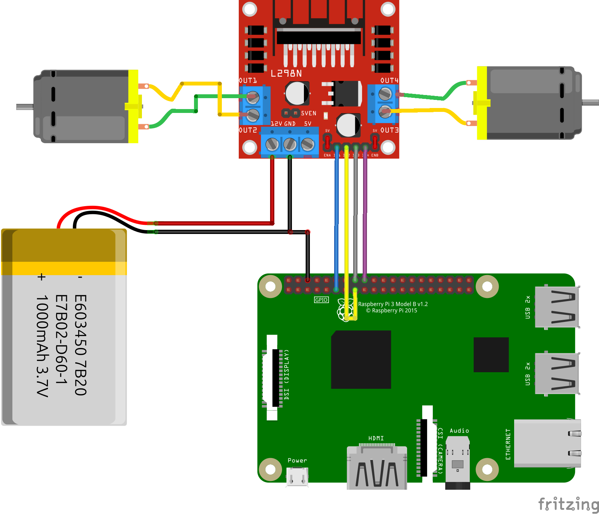
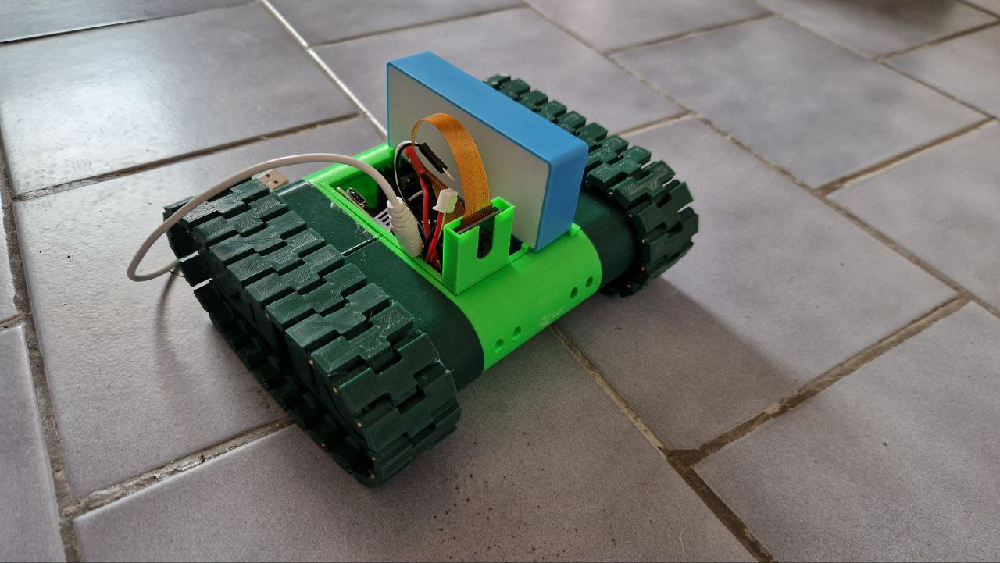

# PiTank
Raspberry Pi Zero2 Tank control  


Raspberry Pi Zero 2 W used with L298N H motor controller and 2 simple geared motors.
Raspberry Pi is powered by power bank, motors (L298N) are powered from 7.4V battery (from RC car) or other battery (6V and above).  
There are two index.html - one for PC control and second for Mobile control (touch display). Just rename it by your wish to index.html.   
To control PiTank you just visit IP address of device (eg. http://192.168.x.y). It runs on port 80.    

There are 2 folders. "Simple" is just for moving PiTank. "LED-Stepper" contains LED light via NeoPixel 8LED WS2812b stick and stepper motor for camera movement up and down. NeoPixel needs additional installation for:
```
sudo pip3 install rpi_ws281x adafruit-circuitpython-neopixel
```

You can set WiFi Access Point on device, so you can use it out of the range of Wifi router. Just run hotspot_on.sh and it will disconnect from WiFi and runs own. Then visit hostname.local (eg. raspberrypi.local) on connected WiFi AP.   

Pins:
```
IN1: GPIO17
IN2: GPIO22
IN3: GPIO23
IN4: GPIO24
```


Python script is Python3 version.  
HTML page is with PiCamera2 via external Python script.

Motors are moving on button hold. When button is released, motors stops.

Create picamera service (name camera.service)
```
sudo nano /etc/systemd/system/camera.service
```

and add this (or copy prepared file):
```
[Unit]
Description=Service for PiCamera

[Service]
ExecStart=python3 /home/pi/camera.py

[Install]
WantedBy=multi-user.target
```
and activate service:
```
sudo systemctl enable camera.service
sudo systemctl start camera.service
```
And finally set crontab:
```
@reboot sudo python3 /path/to/your/PiTank.py
```

I used this print from timmiclark (https://www.thingiverse.com/thing:652851) and it looks like this.

