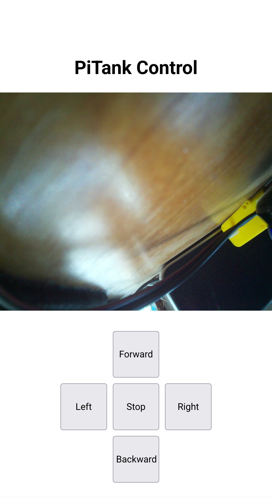

# PiTank
Raspberry Pi Zero2 Tank control  


Raspberry Pi Zero 2 W used with L298N H motor controller and 2 simple geared motors.
Raspberry Pi is powered by power bank, motors (L298N) are powered from 7.4V battery (from RC car) or other battery (6V and above).  
Pins:
```
IN1: GPIO17
IN2: GPIO22
IN3: GPIO23
IN4: GPIO24
```
Python script is Python3 version.  
HTML page is with PiCamera2 via external Python script.

Motors are moving on button hold. When button is released, motors stops.

Create picamera service (name camera.service)
```
sudo nano /etc/systemd/system/camera.service
```

and add this (or copy prepared file):
```
[Unit]
Description=Service for PiCamera

[Service]
ExecStart=python3 /home/pi/camera.py

[Install]
WantedBy=multi-user.target
```
and activate service:
```
sudo systemctl enable camera.service
sudo systemctl start camera.service
```
And finally set crontab:
```
@reboot /path/to/your/PiTank.py
```
